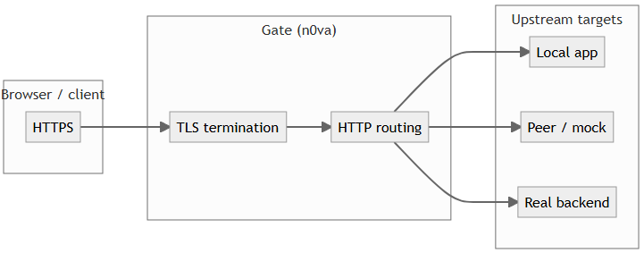
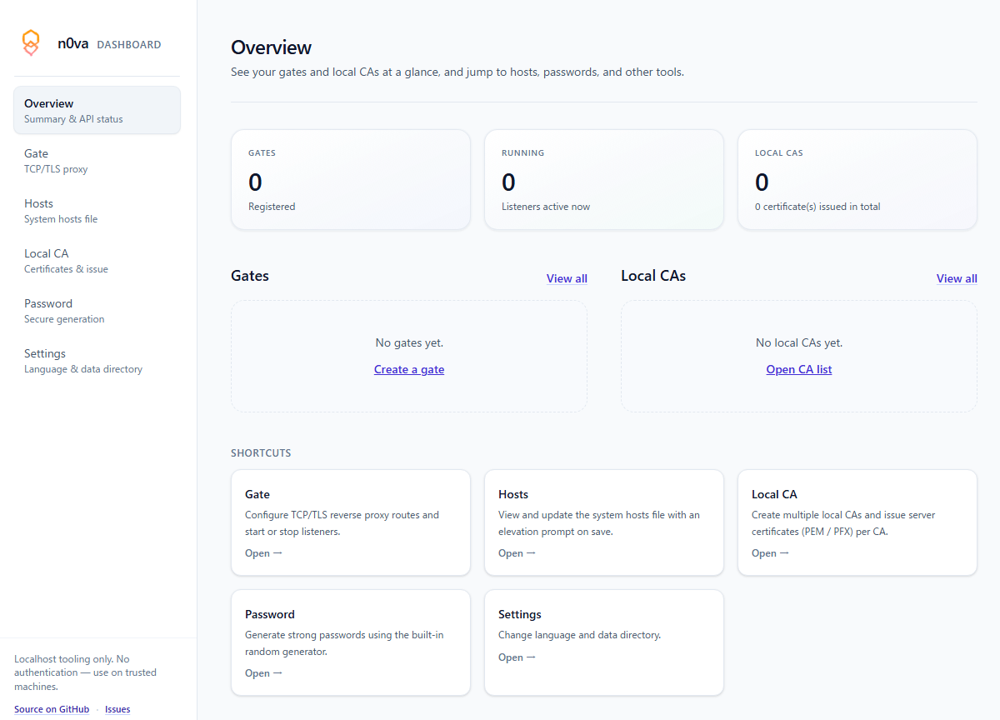

# n0va

[](LICENSE)
[](https://www.python.org/downloads/)
[](pytest.ini)

**Asyncio toolkit** for local dev and tooling: a programmable **Gate** (TCP / TLS / HTTP-aware proxy), **certificate utilities** (CA and issued certs), an optional **dashboard**, plus a small **HTTP/1.1** app surface.

> **Where it shines in practice:** combine **Gate** with **locally issued TLS** so you can run a convincing **HTTPS environment on your machine** without wrestling your production stack. **HTTP routing** lets you send some paths to a local stub and **others to real backends**—so you can iterate on one feature while still talking to the rest of the system.

Not a replacement for production edge proxies, CDNs, or large HTTP frameworks.

**Dual-use tooling:** Gate plus a **locally trusted CA** can behave like **TLS inspection** on an endpoint (same *shape* as corporate HTTPS monitoring on managed devices). That power is documented under [**Security research, dual-use tooling, and LobeliaSecurity**](#security-research-dual-use-tooling-and-lobeliasecurity)—use n0va **only** where you have **clear authorization**.

---

## Contents

- [Highlights](#highlights)
- [Security research, dual-use tooling, and LobeliaSecurity](#security-research-dual-use-tooling-and-lobeliasecurity)
- [At a glance](#at-a-glance)
- [When to use (and not)](#when-to-use-and-not)
- [Install](#install)
- [Local HTTPS: Gate + certificates](#local-https-gate--certificates)
- [Quick start (HTTP server)](#quick-start-http-server)
- [Dashboard](#dashboard)
- [Tests](#tests)
- [Environment variables](#environment-variables)
- [Repository layout](#repository-layout)

---

## Highlights

| Area                 | What you get                                                                                                                                                              |
| -------------------- | ------------------------------------------------------------------------------------------------------------------------------------------------------------------------- |
| **Gate + TLS**       | Terminate TLS (manual certs or **SNI**), forward plain or TLS upstreams, **load-balance** upstream pools, observe or hook **bidirectional** traffic.                      |
| **Certificates**     | **CA** and **server cert** workflows used by the dashboard (stored under your data root); trust the CA locally for browser-friendly HTTPS.                                |
| **HTTP routing**     | **`HttpRoutingGateService`** — route by host/path (and related rules) so **arbitrary endpoints** can hit **localhost**, a **mock**, or a **real** upstream as you choose. |
| **HTTP / WebSocket** | Small **`n0va.Service`** for routes, static files for **dev**, optional TLS — fine for demos and internal tools.                                                          |
| **Dashboard**        | Manage Gate config, CAs, issued certs, and helpers from the browser (`python dashboard/run.py` after building the frontend).                                              |
| **TCP + TLS proxying** | With a **custom root** trusted on the client, Gate can sit **in the middle** of TLS—terminate, inspect or reshape, and re-encrypt—**analogous in principle** to enterprise endpoint HTTPS inspection. The same pattern underpins **authorized** research and **Red Team** tooling; it can also be **misused** (see below). |

---

## Security research, dual-use tooling, and LobeliaSecurity

**What Gate can do (technical):** as a **TCP proxy** with **TLS termination** (and optional forwarding to an upstream, plain or TLS), n0va can expose **cleartext or structured HTTP** to your code after the client has completed TLS to *you*. When the client trusts a **root CA you control** (e.g. one you issue from the dashboard), that trust model matches how **managed endpoints** allow **corporate TLS inspection**: the user or organization installs a **root**, and the proxy can present **names that validate under that PKI**. That is why the feature set is **stronger than “a local HTTPS dev server”**: it is the same class of capability security teams use to **observe and modify** protocol traffic under policy.

**Misuse (explicit):** those mechanics also lower friction for **abusive** scenarios—e.g. **phishing** sites (including **look-alike domains** and **social engineering**) combined with a **user-installed** trust anchor. **LobeliaSecurity does not condone** phishing, fraud, unauthorized surveillance, or interception. Use n0va **only on systems and networks you own or are explicitly authorized to test**, and in compliance with **applicable law** and **organizational rules**.

**About LobeliaSecurity:** **LobeliaSecurity** builds software that is **ordinary and benign** in typical lab and engineering use, but whose primitives overlap **offensive security** and **Red Team** tradecraft (transparent proxies, custom PKI, routing). This repository is published with that **dual-use** reality in mind; capability descriptions are **not** an endorsement of harmful use.

---

## At a glance





---

## When to use (and not)

**Good fit**

- Local **HTTPS** that behaves like production (cookies, HSTS-oriented flows, mixed origins) with **your own CA**.
- **Split routing**: e.g. `/api/new` → local service, everything else → **staging** or **production** (with appropriate caution).
- **Debugging** and **security research** on real protocol bytes through a Gate you control.

**Poor fit**

- Internet-facing production **edge** or **global scale** (use a mature proxy / cloud edge).
- Heavy **static hosting** or **CDN** workloads (serve them with the right tool; n0va’s static path is **dev-oriented**).

---

## Install

```bash
pip install git+https://github.com/LobeliaSecurity/n0va.git
```

Requires **Python ≥ 3.10** and **`pyOpenSSL`** (see `setup.py`).

---

## Local HTTPS: Gate + certificates

1. **Trust model:** create or import a **CA**, issue **server certificates** for the hostnames you use locally (the optional **dashboard** drives this flow and stores material under `<N0VA_DASHBOARD_DATA>/.n0va/` by default).
2. **Gate:** define **entrances** (plain TLS, **SNI**, or manual cert) and **upstreams**; use **`HttpRoutingGateService`** when you need **path/host-based** rules so only the routes you want go to **real** services.
3. **Code:** building blocks live under **`n0va.core.gate`** — e.g. `GateService`, `HttpRoutingGateService`, `GateConfig`, entrances, routes, and **`UpstreamConnectionPool`**.

Programmatic config can be built with the same structures the dashboard uses (see `dashboard/gate_builder.py` for reference mappings from JSON-like dicts to `GateConfig`).

---

## Quick start (HTTP server)

```python
import pathlib
import n0va


class Service(n0va.Service):
    def __init__(self, host, port, root_path):
        super().__init__(host=host, port=port, root_path=root_path)


service = Service(
    host="127.0.0.1",
    port=8080,
    root_path=pathlib.Path("./documents").resolve().as_posix(),
)


@service.onGet("/hello")
async def hello(ctx: n0va.RequestContext) -> n0va.HttpResponse:
    return n0va.HttpResponse(status=200, body=b"ok", content_type=b"text/plain")


service.Start()
```

`n0va.Service` also accepts optional **`dev_static_cache_control`** and **`dev_static_rescan_interval`** for dev static serving (see `n0va/__init__.py`).

More patterns (WebSocket, routing) live under **`example/`**.

---

## Dashboard

Build the Vite frontend, then start the app from the **repository root**:

```bash
cd dashboard/frontend
npm install
npm run build
cd ../..
python dashboard/run.py
```

Defaults: **`127.0.0.1:8765`**, REST under **`/api/v1/`**. Persistent data defaults to **`<cwd>/.n0va/`**; override the base with **`N0VA_DASHBOARD_DATA`** (see below).

---

## Tests

```bash
pytest
```

(`python -m pytest` also works.) Config: **`pytest.ini`** (`testpaths = tests`).

---

## Environment variables

| Variable              | Purpose                                                                                            |
| --------------------- | -------------------------------------------------------------------------------------------------- |
| `N0VA_NO_SUPERVISE`   | Disable parent/child supervision; single process (or use `Service.Start(supervised=False)`).       |
| `N0VA_DASHBOARD_DATA` | Base directory for dashboard data; SQLite and CA material live under `<base>/.n0va/`.              |
| `N0VA_HOSTS_PATH`     | Optional **hosts file** path for dashboard features that edit hosts (set **before** server start). |

Internal: **`N0VA_SUPERVISED_CHILD`** is set by the supervisor for the child process — do not set manually.

---

## Repository layout

| Path           | Role                                                 |
| -------------- | ---------------------------------------------------- |
| `n0va/`        | Core library (Gate, HTTP handler, protocol, certs)   |
| `dashboard/`   | Web UI + API                                         |
| `example/`     | Sample HTTP app                                      |
| `tests/`       | Pytest suite                                         |
| `docs/images/` | Optional README assets (e.g. `readme-dashboard.png`) |

Style notes for the **`n0va/`** package: **`CONTRIBUTING.md`**.

Built-in static file serving targets **development**; use an appropriate stack for heavy production traffic.

---


